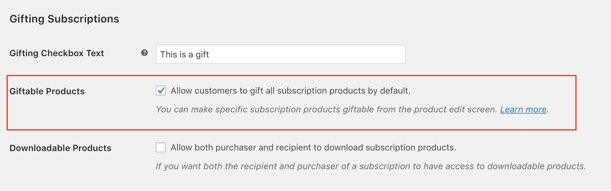
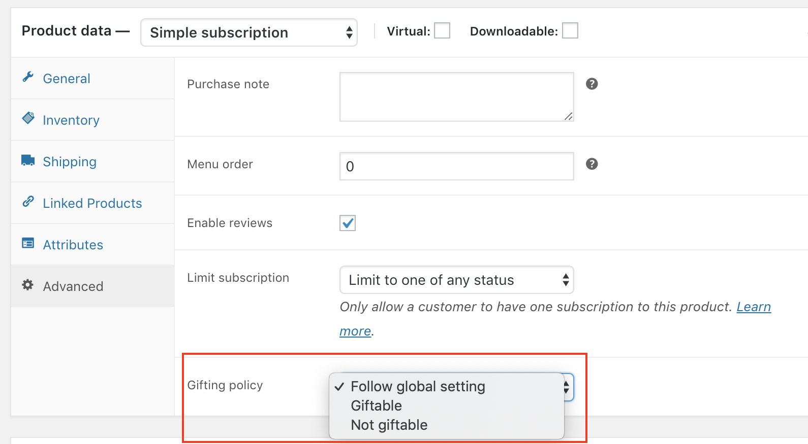

# WooCommerce Subscriptions Gifting - Product Restrictions

This mini-extension integrates with [Gifting for WooCommerce Subscriptions](https://woocommerce.com/products/woocommerce-subscriptions-gifting/) allowing you to restrict gifting to certain specific products.

## Installation

1. Download the latest version of the plugin [here](https://github.com/Prospress/woocommerce-subscriptions-gifting-product-restrictions/releases)
1. Go to **Plugins > Add New > Upload** administration screen on your WordPress site
1. Select the ZIP file you just downloaded
1. Click **Install Now**
1. Click **Activate**

## How to...

### ...modify the default behavior of the Gifting extension?

Once Gifting is installed, all subscription products are subject to gifting. With this extension you can change this default behavior by going to the **WooCommerce > Settings > Subscriptions** and looking for the following setting inside the **Gifting Subscriptions** section:

### ...configure whether a specific subscription product is giftable or not?

Depending on the global setting above, you might want to make a specific product giftable or not. This can be achieved by going to the edit screen for said product and then choosing one of the following settings for the **Gifting policy** option you'll find inside the **Advanced** tab in the **Product data** metabox.

